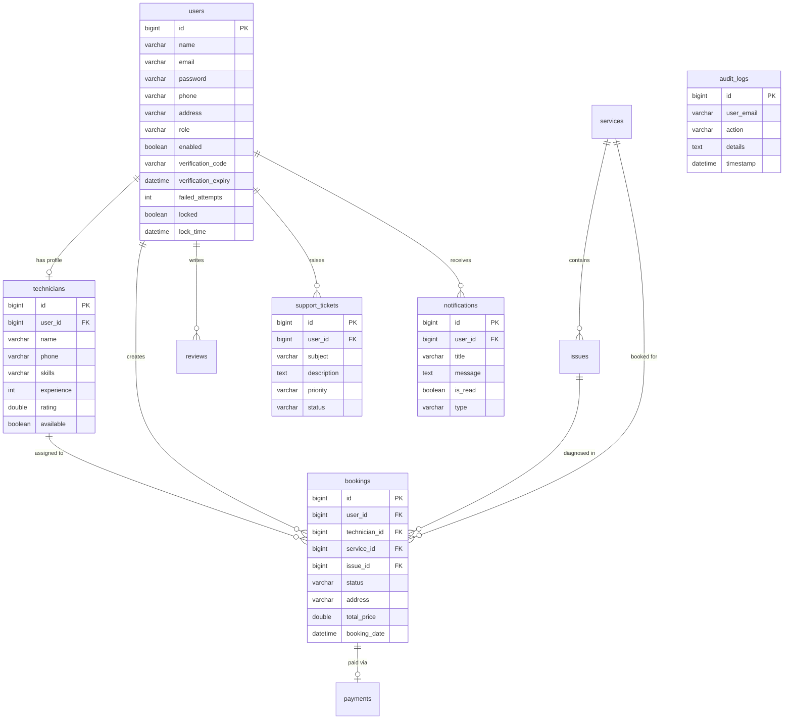

# 🛠️ B1K Services - Home Appliance Repair & Technician Booking System

An enterprise-grade, production-style full-stack web application designed for on-demand home appliance repair and technician booking. The platform seamlessly connects **Citizens (Customers)** seeking appliance repair services, **Technicians (Workers)** managing repair jobs, and **Administrators** managing service catalogs, issues, technician allocations, support tickets, audit logs, and real-time revenue analytics.

Built with a high-performance **Spring Boot 3** backend, **React 19 + Vite** frontend, **MySQL** database, and secured with **Spring Security 6** utilizing **JWT (JSON Web Token)** stateless authentication, Refresh Tokens, Email OTP Verification, Account Lockout Security, and **Role-Based Access Control (RBAC)**.

---

## 📋 Table of Contents

- [✨ Feature Highlights](#-feature-highlights)
  - [👤 Customer / Citizen Features](#-customer--citizen-features)
  - [🛠️ Technician / Worker Features](#️-technician--worker-features)
  - [🛡️ Admin Management Features](#️-admin-management-features)
- [🛠️ Tech Stack](#️-tech-stack)
- [🏗️ Project Structure](#️-project-structure)
- [🔒 Security Architecture & Auth Flow](#-security-architecture--auth-flow)
- [🗄️ Database Schema & Entity Model](#️-database-schema--entity-model)
- [📡 Comprehensive API Endpoints Specification](#-comprehensive-api-endpoints-specification)
  - [1. Authentication Endpoints (`/auth`)](#1-authentication-endpoints-auth)
  - [2. Admin Operations & Provisioning (`/admin`)](#2-admin-operations--provisioning-admin)
  - [3. Booking & PDF Invoice Endpoints (`/booking`)](#3-booking--pdf-invoice-endpoints-booking)
  - [4. Support Tickets (`/tickets`)](#4-support-tickets-tickets)
  - [5. Notifications (`/notifications`)](#5-notifications-notifications)
  - [6. Services & Issues (`/services`, `/issues`)](#6-services--issues-services-issues)
  - [7. Technician Profile & Management (`/technicians`)](#7-technician-profile--management-technicians)
- [🚀 Getting Started & Installation](#-getting-started--installation)
- [🧪 Postman API Testing Payload Examples](#-postman-api-testing-payload-examples)

---

## ✨ Feature Highlights

### 👤 Customer / Citizen Features
- **Public Signup Without Role Selection**: Signup automatically creates `ROLE_USER` accounts.
- **6-Digit Email OTP Verification**: Accounts require email OTP validation before login is allowed.
- **Forgot Password Flow**: Secure password recovery via 6-digit email OTP codes.
- **Service Catalog Browsing & Issue Diagnosis**: Transparent pricing for AC Repair, Washing Machine, Refrigerator, TV, Plumbing, and Electrical services.
- **Instant Repair Booking**: Specify service location address and calculate total diagnostic pricing.
- **Lifecycle Status Tracking**: Track repair progress through 6 stages (`PENDING` ➔ `TECHNICIAN_ASSIGNED` ➔ `TECHNICIAN_ACCEPTED` ➔ `IN_PROGRESS` ➔ `COMPLETED` ➔ `REVIEWED`).
- **PDF Invoice Download**: One-click PDF receipt generation for completed repair bookings.
- **Support Ticket System**: Raise support tickets with priority levels (`LOW`, `MEDIUM`, `HIGH`, `URGENT`) and monitor resolution status.
- **Notifications Bell**: In-app notifications for booking assignment, progress updates, and support responses with unread badge count.

### 🛠️ Technician / Worker Features
- **Admin-Managed Accounts**: Technicians cannot sign up publicly; only administrators can provision technician accounts with temporary credentials.
- **Availability Toggle**: Switch status between "Available for Jobs" and "Offline".
- **Job Accept / Reject**: Review assigned repair tasks and accept (`TECHNICIAN_ACCEPTED`) or reject (`PENDING`) incoming bookings.
- **Job Progress Control**: Update repair status (`IN_PROGRESS` ➔ `COMPLETED`).
- **Rating & Reviews View**: Track star ratings and feedback left by customers.

### 🛡️ Admin Management Features
- **Automated Startup Admin Initialization**: Default administrator (`admin@b1kservices.com` / `Admin@123`) created automatically on startup.
- **Technician Account Provisioning**: Add skilled technicians, assign skills/experience, and dispatch automated welcome emails with temp credentials.
- **Real-Time Analytics Dashboard**: Monitor Total Users, Total Technicians, Bookings Today, Completed Jobs, Total Revenue, Monthly Revenue, and Pending Requests.
- **Support Ticket Resolution**: Assign and resolve customer support tickets.
- **Security Audit Trail**: View real-time logs of logins, account lockouts, technician provisioning, booking updates, and password resets.
- **User Account Lock / Toggle**: Enable or disable user access.

---

## 🛠️ Tech Stack

### **Backend (Spring Boot)**
* **Language & Framework**: Java 21 / 17, Spring Boot 3
* **Security**: Spring Security 6, JJWT (`0.11.5`), BCrypt Password Encoding
* **Mail & Validation**: Spring Boot Starter Mail, Jakarta Validation (`@NotBlank`, `@Email`, `@Valid`)
* **PDF Invoicing**: OpenPDF (`com.github.librepdf:openpdf:2.0.3`)
* **Persistence**: Spring Data JPA, Hibernate, MySQL 8.x
* **Utilities**: Lombok, Jackson JSON Processor, Maven

### **Frontend (React)**
* **Framework & Build Tool**: React 19, Vite
* **Routing**: React Router DOM v7
* **HTTP Client**: Axios (with custom JWT & Refresh Token interceptors)
* **Styling**: Tailwind CSS v4, Custom Glassmorphism UI
* **Icons**: React Icons (`react-icons/fa`)

---

## 🏗️ Project Structure

```
Repair_Project_with_Dhanush/
├── README.md                   # Complete Project Documentation
├── UC/                         # Spring Boot Backend Project
│   ├── pom.xml                 # Maven Dependencies (Spring Mail, Validation, OpenPDF, JWT)
│   └── src/main/java/com/klu/
│       ├── UcApplication.java            # Spring Boot Main Entry Point
│       ├── controller/                   # REST API Controllers (Admin, Auth, Booking, Ticket, Notification, etc.)
│       ├── dto/                          # Data Transfer Objects (SignupRequest, ErrorResponse, etc.)
│       ├── model/                        # JPA Entities (User, Technician, Booking, Payment, SupportTicket, Notification, AuditLog)
│       ├── repository/                   # Spring Data Repositories
│       ├── security/                     # SecurityConfig, AdminInitializer, JwtFilter, GlobalExceptionHandler
│       └── service/                      # Business Logic (UserService, AdminService, EmailService, PdfInvoiceService, etc.)
└── uc-frontend/                # React Vite Frontend Application
    └── src/
        ├── App.jsx             # React Router Definition & Role Guards
        ├── api/axios.js        # Global Axios Instance with Bearer Token Interceptors
        ├── components/
        │   ├── Landing.jsx                       # Public Home Showcase
        │   ├── Login.jsx                         # Login & Forgot Password Modal
        │   ├── SingUp.jsx                        # Customer Signup & OTP Verification Step
        │   ├── ProtectedRoute.jsx                # Role Guard
        │   ├── dashboards/
        │   │   ├── AdminDashbaord.jsx            # Admin Analytics, Tech Creator, Ticket Resolver, Audit Trail
        │   │   ├── CitizenDashboard.jsx          # Customer Portal, Booking Tracker, PDF Invoice, Notifications, Support Modal
        │   │   └── WorkerDashboard.jsx           # Technician Workorder Lifecycle & Availability Toggle
        │   └── pages/                            # Service Creation, Issue Builder, Technician Assignment, Profile Edit
```

---

## 🔒 Security Architecture & Auth Flow

```
+---------------------------------------------------------------------------------------------------+
|  1. CUSTOMER SIGNUP (POST /auth/signup)                                                           |
|     - No role selection in payload. Backend automatically sets role = ROLE_USER and enabled = false.|
|     - Generates 6-digit OTP, sends verification email. Account unlocked via POST /auth/verify-email.|
+---------------------------------------------------------------------------------------------------+
|  2. LOGIN & LOCKOUT (POST /auth/login)                                                            |
|     - BCrypt password matching. 5 failed login attempts lock account for 15 minutes.               |
|     - Returns Access Token + Refresh Token upon successful credential validation.                 |
+---------------------------------------------------------------------------------------------------+
|  3. DEFAULT ADMIN INITIALIZATION                                                                  |
|     - AdminInitializer checks for admin@b1kservices.com on boot and creates ROLE_ADMIN if absent.|
+---------------------------------------------------------------------------------------------------+
|  4. ADMIN PROVISIONING OF TECHNICIANS (POST /admin/technicians)                                    |
|     - Only ROLE_ADMIN can create technicians. Sends welcome email with temporary password.         |
+---------------------------------------------------------------------------------------------------+
```

---

## 🗄️ Database Schema & Entity Model



---

## 📡 Comprehensive API Endpoints Specification

### 1. Authentication Endpoints (`/auth`)
| Method | Endpoint | Authorization | Description |
| :--- | :--- | :--- | :--- |
| `POST` | `/auth/signup` | Public | Register customer account (forces `ROLE_USER`, sends 6-digit OTP). |
| `POST` | `/auth/verify-email` | Public | Verify 6-digit email OTP to activate account. |
| `POST` | `/auth/resend-otp` | Public | Resend 6-digit account verification OTP. |
| `POST` | `/auth/login` | Public | Authenticate credentials (enforces 5-attempt lockout). Returns JWT + Refresh token. |
| `POST` | `/auth/refresh-token` | Public | Issue new access token using valid refresh token. |
| `POST` | `/auth/forgot-password` | Public | Initiate password reset (sends 6-digit OTP). |
| `POST` | `/auth/verify-reset-otp` | Public | Verify password reset OTP code. |
| `POST` | `/auth/reset-password` | Public | Reset password using verified OTP code. |

### 2. Admin Operations & Provisioning (`/admin`)
| Method | Endpoint | Authorization | Description |
| :--- | :--- | :--- | :--- |
| `POST` | `/admin/technicians` | `ROLE_ADMIN` | Create technician account (`ROLE_TECHNICIAN`), send welcome email. |
| `GET` | `/admin/analytics` | `ROLE_ADMIN` | Get live analytics (Users, Technicians, Revenue, Bookings Today, Completed Jobs). |
| `GET` | `/admin/audit-logs` | `ROLE_ADMIN` | Get system security audit trail. |
| `PUT` | `/admin/users/{userId}/toggle-status` | `ROLE_ADMIN` | Enable or disable user account access. |

### 3. Booking & PDF Invoice Endpoints (`/booking`)
| Method | Endpoint | Authorization | Description |
| :--- | :--- | :--- | :--- |
| `POST` | `/booking/create` | `ROLE_USER` | Create new repair booking (`PENDING`). |
| `GET` | `/booking/user/{userId}` | `ROLE_USER` | Get bookings created by a specific user. |
| `GET` | `/booking/technician/{technicianId}` | `ROLE_TECHNICIAN`, `ROLE_ADMIN` | Get jobs assigned to technician. |
| `GET` | `/booking/{bookingId}/invoice` | Authenticated | Generate and download PDF invoice receipt. |
| `PUT` | `/booking/{bookingId}/status?status=STATUS` | `ROLE_TECHNICIAN`, `ROLE_ADMIN` | Update booking status (`TECHNICIAN_ACCEPTED`, `IN_PROGRESS`, `COMPLETED`). |
| `PUT` | `/booking/{bookingId}/assign/{technicianId}` | `ROLE_ADMIN` | Assign technician to booking (`TECHNICIAN_ASSIGNED`). |

### 4. Support Tickets (`/tickets`)
| Method | Endpoint | Authorization | Description |
| :--- | :--- | :--- | :--- |
| `POST` | `/tickets/create` | Authenticated | Raise a new support ticket. |
| `GET` | `/tickets/user/{userId}` | Authenticated | Get tickets submitted by a specific user. |
| `GET` | `/tickets/all` | `ROLE_ADMIN` | List all system support tickets. |
| `PUT` | `/tickets/{ticketId}/status` | `ROLE_ADMIN` | Update support ticket status (`RESOLVED`, `CLOSED`). |

### 5. Notifications (`/notifications`)
| Method | Endpoint | Authorization | Description |
| :--- | :--- | :--- | :--- |
| `GET` | `/notifications/user/{userId}` | Authenticated | Get notifications for a user. |
| `GET` | `/notifications/unread-count/{userId}` | Authenticated | Get unread notification badge count. |
| `PUT` | `/notifications/{id}/read` | Authenticated | Mark notification as read. |

---

## 🚀 Getting Started & Installation

### Prerequisites
- JDK 17 or 21 (Tested on OpenJDK 21)
- Node.js (v18+) & `npm`
- MySQL Server 8.x

### Database Setup
```sql
CREATE DATABASE uc;
```

### Backend Startup
```bash
cd UC
# Specify JAVA_HOME if multiple JDKs exist:
JAVA_HOME=/path/to/jdk-21 ./mvnw spring-boot:run
```
*Backend runs on `http://localhost:8080`.*

### Frontend Startup
```bash
cd uc-frontend
npm install
npm run dev
```
*Frontend runs on `http://localhost:5173`.*

---

## 🧪 Postman API Testing Payload Examples

### Customer Signup (`POST /auth/signup`)
```json
{
  "name": "John Doe",
  "email": "john@gmail.com",
  "password": "Password@123",
  "phone": "9999999999",
  "address": "Hyderabad"
}
```

### Verify Email OTP (`POST /auth/verify-email`)
```json
{
  "email": "john@gmail.com",
  "otp": "123456"
}
```

### Admin Provisions Technician (`POST /admin/technicians`)
```json
{
  "name": "Rohan Sharma",
  "email": "rohan@b1kservices.com",
  "phone": "9876543210",
  "skills": "AC Repair, Electrical",
  "experience": 4,
  "tempPassword": "TechPass@123",
  "available": true
}
```

---

## 📝 Maintainers
Developed as a production-style Home Appliance Repair Platform.
